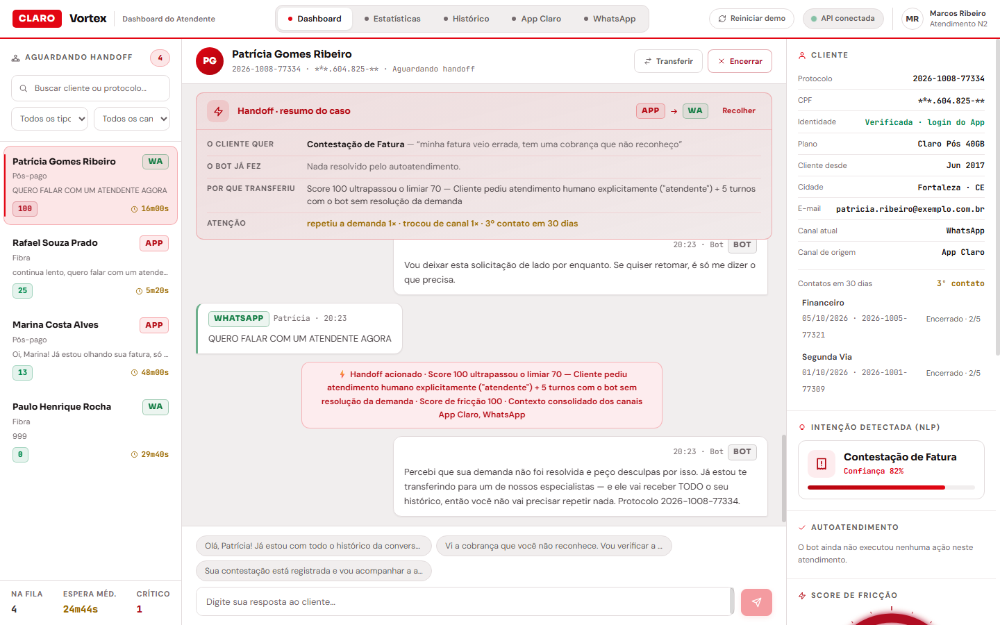
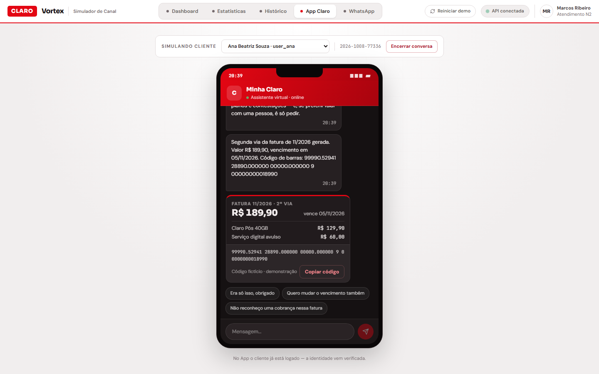
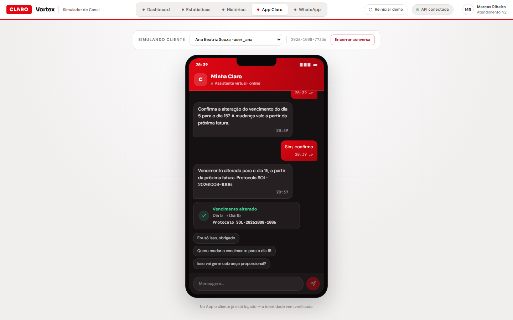
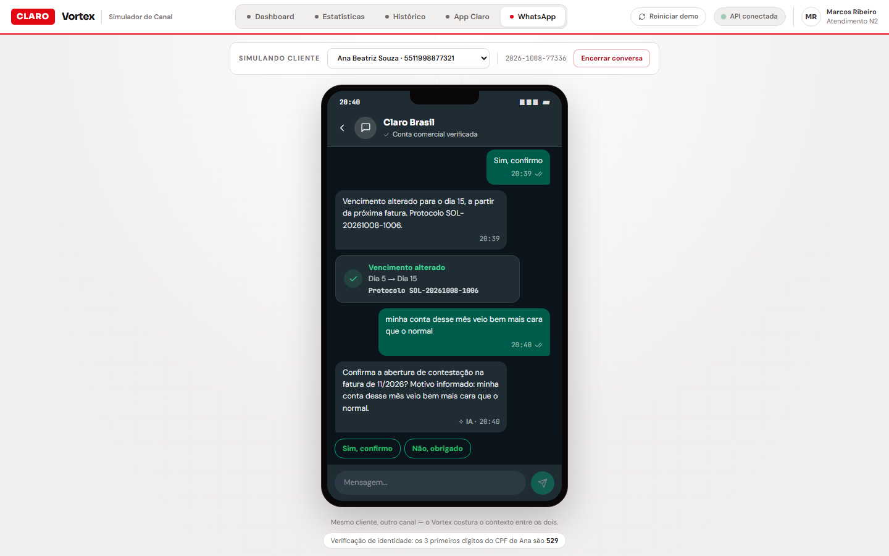
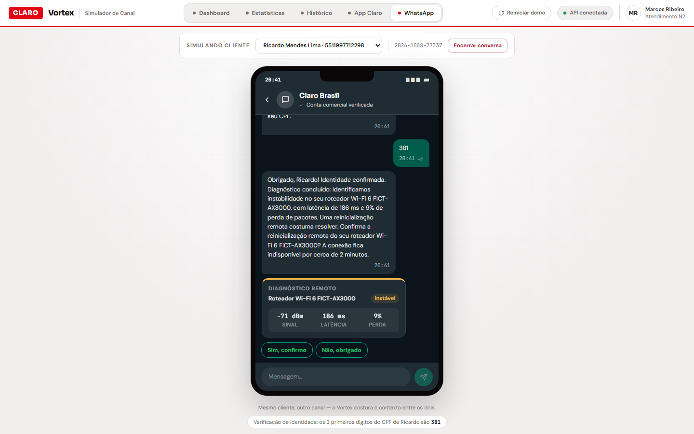
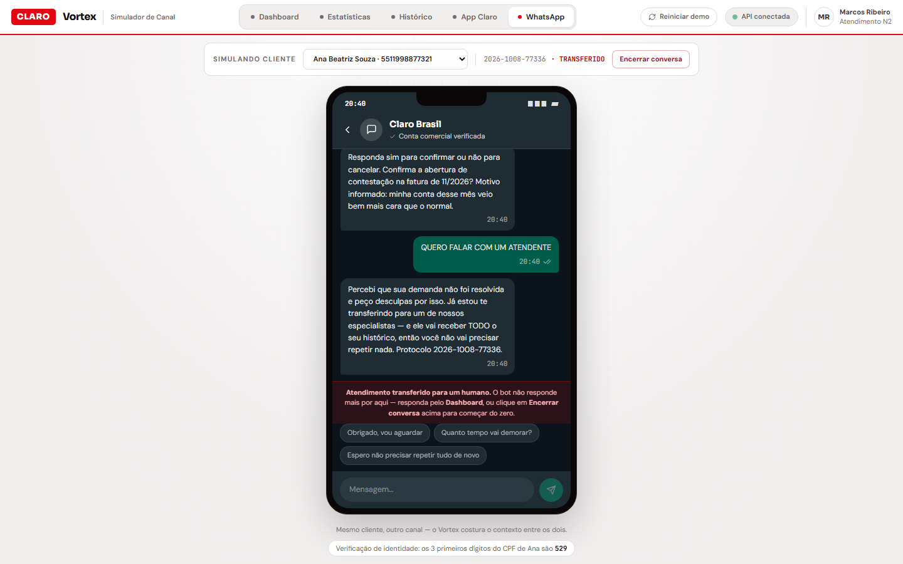
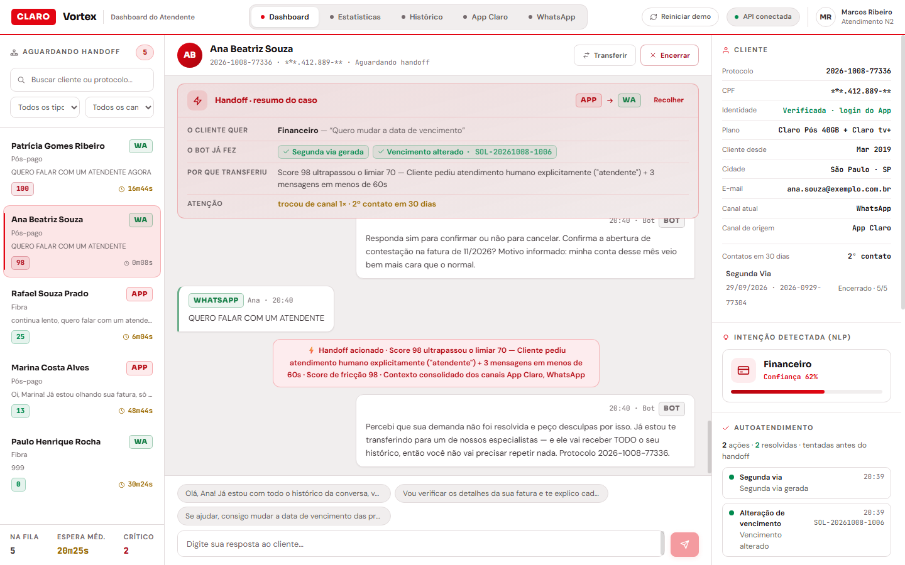
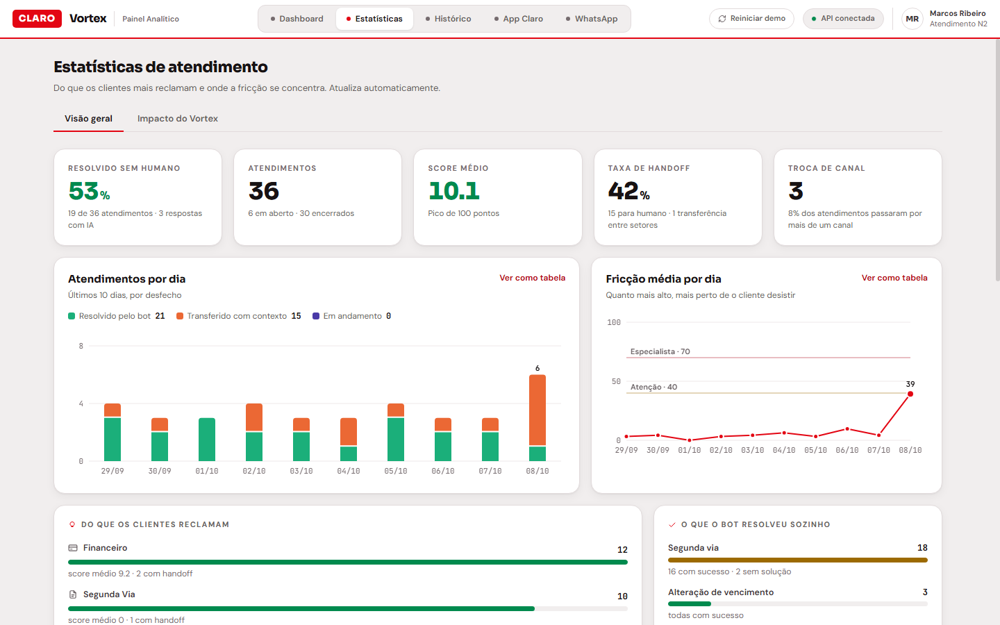
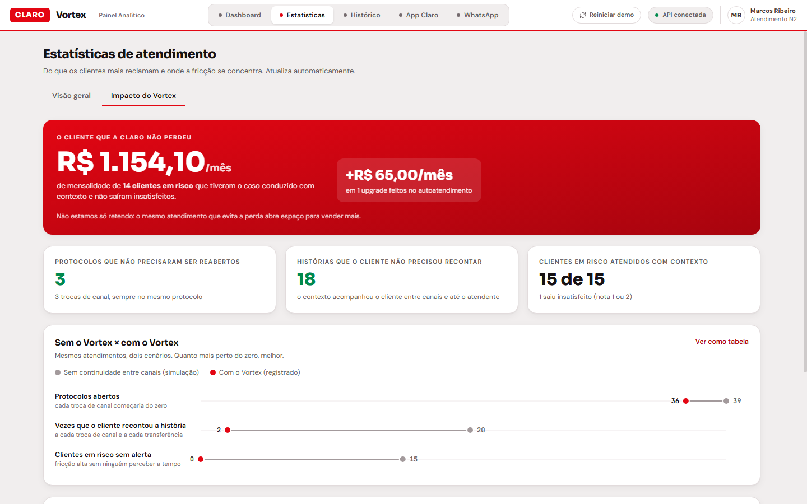
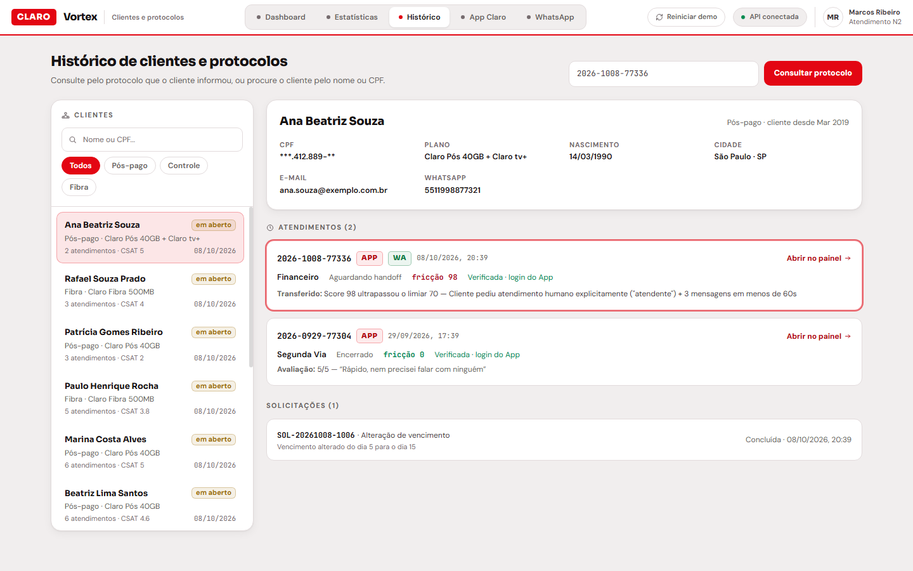

# Vortex

**Camada de orquestração inteligente entre os canais de atendimento da Claro.**
Challenge FIAP + Claro 2026 · turma 4SIT-2026

> Um protocolo, um cliente, nenhuma história repetida.

**🌐 Acesse o Vortex:** https://vortex-claro-2026.onrender.com
(no plano gratuito, o primeiro acesso pode levar cerca de 1 minuto)

## 🎥 Vídeo de demonstração

[](https://www.youtube.com/watch?v=AH6rnTh0_UQ)

**Assista:** https://www.youtube.com/watch?v=AH6rnTh0_UQ



---

## Integrantes

| Nome | RM |
|---|---|
| Pablo Samuel Rangel Quilaqueo Aguayo | 551548 |
| Gustavo Matos dos Santos | 551268 |
| Leonardo Franco de Oliveira | 552528 |
| Heitor Novaes dos Santos | 98342 |
| Enzo Gabriel Nascimento Campos | 552006 |

---

## 1. O problema

Uma operadora atende o mesmo cliente por vários canais, e cada canal enxerga só
a si mesmo. O cliente tenta pelo App, não resolve e vai para o WhatsApp. Lá, o
atendimento recomeça do zero: ele repete o CPF, repete o problema, repete a
frustração. Quando finalmente chega a um atendente, já está exausto, e o
atendente recebe uma conversa sem passado.

São duas perdas ao mesmo tempo:

- **o contexto**, que se perde na passagem de um canal para outro;
- **o tempo**, porque ninguém percebe que o cliente passou do limite antes de
  ele escrever "quero falar com uma pessoa".

## 2. A proposta

A insatisfação aparece antes de ser declarada. Repetir a pergunta, reformular
o pedido, trocar de canal e escrever em caixa alta são sinais mensuráveis. O
Vortex soma esses sinais num número único, o **Score de Fricção**, e age quando
ele passa do limite.

O Vortex faz três coisas:

1. **Continuidade entre canais.** O cliente que sai do App e entra no WhatsApp
   continua no **mesmo protocolo**, com o histórico inteiro.
2. **Autoatendimento de verdade.** Segunda via, troca de vencimento, diagnóstico
   e reinício do roteador, upgrade de plano, contestação de cobrança e consulta
   de protocolo são resolvidos dentro da conversa, sempre com confirmação antes
   de alterar algo.
3. **Transferência no momento certo, com contexto.** Quando a fricção passa de
   70, o cliente pede uma pessoa ou o bot não tem solução, o caso vai para um
   atendente com o resumo pronto. O atendente não precisa perguntar nada.

---

## 3. A jornada, passo a passo

### 3.1 App Claro: o bot resolve sozinho

A assistente se apresenta como IA e informa o protocolo logo na abertura. A
cliente pede a segunda via e recebe o cartão da fatura. Depois troca o
vencimento: o bot oferece os dias permitidos e pede confirmação antes de
alterar.

| Segunda via | Troca de vencimento |
|---|---|
|  |  |

### 3.2 WhatsApp: mesmo cliente, outro canal

A cliente vai para o WhatsApp e continua **no mesmo protocolo**, com a conversa
do App visível. A IA entende uma reclamação escrita de forma livre ("minha
conta veio bem mais cara") e propõe abrir uma contestação. As respostas
geradas pela IA levam a marca **✦ IA**.

No WhatsApp não há login. Quando o cliente começa por ali, o bot confirma a
identidade com os **3 primeiros dígitos do CPF** antes de mostrar qualquer
dado, e em seguida responde ao pedido que ficou pendente.

| Continuidade e IA | Verificação de identidade |
|---|---|
|  |  |

### 3.3 A fricção sobe e o caso vai para uma pessoa

"Isso é um absurdo, já expliquei três vezes" e "QUERO FALAR COM UM ATENDENTE"
fazem o Score de Fricção passar de 70. O Vortex transfere o atendimento e avisa
a cliente de que ela não vai precisar repetir nada.



### 3.4 Dashboard: o atendente recebe tudo

O caso chega com o **resumo pronto**: o que a cliente quer, o que o bot já fez,
por que transferiu e os alertas (trocou de canal, segundo contato no mês). Ao
lado ficam a identidade verificada, os dados da conta, a intenção detectada e
as ações de autoatendimento. O atendente usa respostas rápidas e, ao encerrar,
a cliente recebe a pesquisa de satisfação no próprio canal.



### 3.5 Resultados

**Estatísticas** mostra volume por dia, motivos de contato, taxa de resolução
sem humano e a fricção ao longo do tempo. **Impacto do Vortex** traduz isso em
negócio: a mensalidade dos clientes em risco que foram atendidos com contexto,
os protocolos que não precisaram ser reabertos e a comparação "sem o Vortex ×
com o Vortex".





### 3.6 Histórico

Qualquer protocolo informado pelo cliente pode ser consultado: a ficha do
cliente, todos os atendimentos com fricção e avaliação, e as solicitações
concluídas.



---

## 4. Como funciona

### 4.1 O fluxo de cada mensagem

Toda mensagem, de qualquer canal, passa pelo mesmo caso de uso
(`OrquestradorService`):

1. **Identifica o cliente** a partir do canal (telefone no WhatsApp, usuário no
   App).
2. **Recupera a sessão viva** do cliente, se existir. É aqui que o protocolo
   continua mesmo vindo de outro canal.
3. **Classifica a intenção** por regras e **grava a mensagem** marcada com o
   canal.
4. **Avalia a fricção** com nove detectores independentes e registra um evento
   para cada sinal encontrado.
5. **Decide quem responde**, nesta ordem: transferência para humano → fila
   humana → verificação de identidade → despedida → autoatendimento → resposta
   padrão do bot.

### 4.2 O Score de Fricção

| Sinal | Peso |
|---|---|
| Pedido explícito de atendente | +25 |
| Repetição (literal ou reformulada) | +18 |
| Troca de canal | +16 |
| Sentimento negativo | +6 a +20 |
| Mesma intenção repetida | +12 |
| Conversa em loop sem resolução | +8 por turno (até +24) |
| Impaciência (3 mensagens em 60s) | +8 |
| Caixa alta | +5 |
| Atendente assume o caso | −12 |

O score vai de 0 a 100 e a transferência acontece em **70**. Todos os pesos
ficam em `backend/app/config.py`.

### 4.3 Onde entra a IA

A IA (Google Gemini) é uma **camada de linguagem**, não quem toma decisões:

- As regras determinísticas rodam primeiro. A IA só é chamada quando elas não
  entendem a frase.
- A resposta da IA só pode sugerir ações do catálogo, e é validada antes de
  virar qualquer coisa: dias e planos têm que estar entre as opções oferecidas,
  e texto com números longos, valores ou protocolos é descartado.
- Se a IA falhar ou demorar mais de 4 segundos, a conversa segue pelas regras.

### 4.4 Privacidade e segurança

- **Todos os dados são fictícios.** Nomes, CPFs, faturas e equipamentos foram
  inventados; os códigos de barras usam um banco que não existe.
- O **CPF não sai pela API**: o frontend recebe uma referência opaca (HMAC).
- O que vai para a IA é **anonimizado**: o nome do cliente vira `[nome]` e as
  respostas da verificação de identidade não são enviadas.
- No WhatsApp, a **identidade é confirmada** antes de mostrar qualquer dado.
  Três erros bloqueiam a conversa e transferem para um atendente.
- O botão **"Reiniciar demo"** exige um token de administração em produção.
- Senhas e chaves ficam só em variáveis de ambiente, nunca no repositório.

---

## 5. Arquitetura

```
routers  →  services  →  repositories (interfaces)  →  domain
                              │
                   ┌──────────┴──────────┐
               memória              PostgreSQL (Neon)
```

A dependência só aponta para dentro. Os services falam com interfaces de
repositório; com `DATABASE_URL` definida a aplicação usa PostgreSQL, e sem ela
roda em memória (é assim que os testes rodam).

| Camada | Tecnologia |
|---|---|
| Backend | Python 3.13, FastAPI (async), Pydantic v2 |
| Banco | PostgreSQL no Neon, via asyncpg |
| IA | Google Gemini (`gemini-3.5-flash-lite`) |
| Frontend | React 18, Vite, Tailwind CSS v4 |
| Hospedagem | Render (o FastAPI serve a interface compilada) |

```
Vortex/
├── backend/
│   ├── app/
│   │   ├── routers/        rotas HTTP (canais, dashboard, saúde)
│   │   ├── services/       orquestrador, fricção, diálogo, IA, verificação...
│   │   ├── repositories/   interfaces + memória + PostgreSQL
│   │   ├── domain/         modelos, catálogo de ações, enums
│   │   └── core/           protocolo, privacidade, interpretação de texto
│   └── tests/              testes automatizados (pytest)
├── frontend/
│   ├── src/                dashboard, estatísticas, histórico e simuladores
│   └── dist/               interface compilada, servida pelo backend
└── docs/                   arquitetura e imagens deste README
```

---

## 6. Como rodar localmente

Requer Python 3.11+ (e Node 18+ só para alterar o frontend).

```bash
cd backend
python -m venv .venv
.venv\Scripts\activate            # Windows  (Linux/macOS: source .venv/bin/activate)
pip install -e ".[dev]"
uvicorn app.main:app --port 8000
```

Abra http://localhost:8000. Sem `.env`, tudo roda em memória e sem IA. Para
usar banco e IA, copie `backend/.env.example` para `backend/.env` e preencha
`DATABASE_URL` e `GEMINI_API_KEY`.

| Tela | Endereço |
|---|---|
| Dashboard do atendente | `/` |
| Estatísticas | `/estatisticas` |
| Histórico | `/historico` |
| Simulador App Claro | `/sim/app` |
| Simulador WhatsApp | `/sim/whatsapp` |
| Documentação da API | `/docs` |

**Testes:** `pytest -q` dentro de `backend/`.

**Frontend:** depois de alterar algo em `frontend/src`, rode `npm install` e
`npm run build` em `frontend/` para atualizar a pasta `dist`.

### Clientes de demonstração

| Cliente | Plano | Código do WhatsApp |
|---|---|---|
| Ana Beatriz Souza | Pós 40GB | 529 |
| Ricardo Mendes Lima | Fibra 500MB | 381 |
| Juliana Ferraz | Controle 25GB | 441 |
| Carlos Eduardo Nunes | Pós Família 80GB | 290 |

O código são os 3 primeiros dígitos do CPF fictício, e o próprio simulador
mostra a dica embaixo do celular.

---

## 7. Deploy

O arquivo `render.yaml` descreve o serviço. No Render: **New → Blueprint**,
escolha este repositório e preencha `DATABASE_URL`, `GEMINI_API_KEY` e
`ADMIN_TOKEN`. O plano gratuito hiberna sem acesso, então abra a URL alguns
minutos antes de apresentar.
